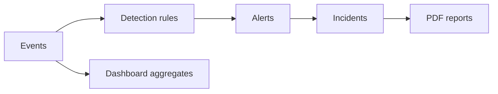

# CyberGuard AI — Full instructor handbook (defense preparation)

**Who this is for:** You (the teacher) leading **Jana, Yazan, Yamen, and Mohammad** through the project before committee / “doctors” discussion.  
**How to use this file:** Read **Section 0** once. For each session, follow **Section 1** agenda. During class, you can read **“قل / Say”** blocks aloud or paraphrase. Give students **Section 2 glossary** as a handout. Assign **Section 13** checklists before rehearsal.

> **للمشرف:** هذا الملف مكتوب بالإنجليزية لتسهيل الاقتباس من أسماء الملفات والمسارات؛ علِّم بالعربي كما تحب. المصطلحات بين قوسين عربية في قاموس §2.

---

## Table of contents

0. [For the teacher — how this handbook is organized](#0-for-the-teacher--how-this-handbook-is-organized)
1. [Suggested session agendas (you pick one)](#1-suggested-session-agendas-you-pick-one)
2. [Student glossary (English + Arabic hints)](#2-student-glossary-english--arabic-hints)
3. [Opening script (~2 minutes, teacher verbatim)](#3-opening-script-2-minutes-teacher-verbatim)
4. [What this project is (elevator pitch + deeper pitch)](#4-what-this-project-is-elevator-pitch--deeper-pitch)
5. [Defense mindset: what examiners actually grade](#5-defense-mindset-what-examiners-actually-grade)
6. [Architecture at a glance (teach + draw on board)](#6-architecture-at-a-glance-teach--draw-on-board)
7. [Dashboard — complete walkthrough (every card + every chart)](#7-dashboard--complete-walkthrough-every-card--every-chart)
8. [Alerts page — complete walkthrough](#8-alerts-page--complete-walkthrough)
9. [Incidents — list, detail, portfolio report](#9-incidents--list-detail-portfolio-report)
10. [Reports (PDF library)](#10-reports-pdf-library)
11. [Attack Lab and cyber range — complete walkthrough](#11-attack-lab-and-cyber-range--complete-walkthrough)
12. [Marketing landing page — Jana’s deep track (file map)](#12-marketing-landing-page--janas-deep-track-file-map)
13. [Team split, homework, rehearsal checklist](#13-team-split-homework-rehearsal-checklist)
14. [Demo scripts (short + long + failure backup)](#14-demo-scripts-short--long--failure-backup)
    - [14.4 Minute-by-minute runbook (Option A, ~90 min)](#144-minute-by-minute-runbook-option-a-90-min)
    - [14.5 Per-student “first 30 seconds” scripts](#145-per-student-first-30-seconds-scripts)
15. [Committee Q&A — expanded with model answers](#15-committee-qa--expanded-with-model-answers)
16. [Appendix A — AI prompt for slide deck](#appendix-a--ai-prompt-for-slide-deck)
17. [Appendix B — PowerPoint vs Streamlit](#appendix-b--powerpoint-vs-streamlit)
18. [Document control](#18-document-control)

---

## 0. For the teacher — how this handbook is organized

**You asked for a “full” document:** this version is written so you can **teach line-by-line**, not only skim headings.

- **Sections 3–6:** framing + architecture (set confidence).
- **Section 7:** longest section — **matches the real dashboard layout** in `frontend/src/app/(app)/dashboard/page.tsx` plus charts in `frontend/src/components/dashboard/overview-charts.tsx`.
- **Sections 8–11:** each major app area with **what is on screen**, **what API concept backs it**, and **what to say to doctors**.
- **Section 12:** landing page broken into **which file teaches which story** so Jana can prepare without reading the whole backend.
- **Sections 13–15:** practical division of labor, rehearsal, and **model answers** (students freeze less when they have a sentence ready).

**Teaching style tip:** After each module, ask: *“What would break if we removed Postgres?”* or *“Who is allowed to see this row?”* — forces ownership of **auth** and **data model**.

---

## 1. Suggested session agendas (you pick one)

### Option A — Single long night (~90 minutes)

| Minutes | Topic | What you do |
|--------:|-------|----------------|
| 0–5 | Intro | Section 3 script + Section 5 mindset |
| 5–15 | Architecture | Section 6 + draw pipeline on board |
| 15–40 | Dashboard | Section 7: scroll real UI top-to-bottom |
| 40–55 | Alerts | Section 8: live filter + acknowledge |
| 55–70 | Incidents | Section 9: open one incident + mention portfolio |
| 70–82 | Attack Lab | Section 11: one synthetic run |
| 82–88 | Landing | Section 12: quick tour for Jana |
| 88–90 | Assign | Section 13 homework + next rehearsal time |

### Option B — Two shorter sessions

**Session 1 (45 min):** Sections 3–6, then Section 7 up through “Analyst work queue” + KPI strip.  
**Session 2 (45 min):** Finish Section 7 (charts + bottom cards), Sections 8–12, then Section 14 demo drill.

---

## 2. Student glossary (English + Arabic hints)

| Term | One-line meaning | عربي (مختصر) |
|------|------------------|--------------|
| **Event** | A normalized security signal stored in the DB (log-like record feeding rules). | حدث أمني مسجّل |
| **Rule** | Logic that matches events and raises an **alert** (rule name shown in UI). | قاعدة كشف |
| **Alert** | “Something matched a rule” — triage object (new / acknowledged / resolved). | تنبيه للمعالجة |
| **Incident** | Investigation **case** that can group multiple events/alerts. | حادثة / قضية تحقيق |
| **Severity** | Priority / impact label (low → critical). | خطورة |
| **MTTA** | Mean time to **acknowledge** an alert (after creation). | زمن أول إقرار بالتنبيه |
| **MTTR** | Mean time to **resolve** work in the window (alerts/incidents lifecycle). | زمن الإغلاق / الحل |
| **JWT** | Token proving login; sent on API calls as `Authorization: Bearer …`. | رمز جلسة |
| **Owner isolation** | Each user sees only **their** rows (`owner_id` on server). | عزل بيانات بين المستخدمين |
| **MITRE ATT&CK** | Industry taxonomy of tactics/techniques (IDs like T1046). | إطار تقنيات الهجوم |
| **Synthetic scenario** | Backend-built telemetry bundle ingested “as if” from sensors. | سيناريو محاكاة داخلي |
| **Cyber range** | Docker target + runner traffic; logs drain into ingestion. | مدى تدريب معزول |
| **Deterministic metrics** | Numbers computed in code/SQL — same input → same output. | أرقام محسوبة وليست من الخيال |
| **Advisory AI** | Language model text that **must not** override facts; charts stay grounded. | ذكاء اصطناعي استشاري فقط |

---

## 3. Opening script (~2 minutes, teacher verbatim)

**Say:**

> “Tonight we are not memorizing buzzwords. We are learning **one story**: security telemetry becomes **events**, rules become **alerts**, analysts build **incidents**, and the product gives you **dashboards** to see pressure and **reports** to close work. CyberGuard is a **full-stack academic prototype**: Next.js UI, FastAPI API, Postgres persistence, optional background jobs and websockets, plus optional LLM features that are always **advisory** unless we measure them formally.
>
> The committee will not ask you to be Palo Alto Networks. They will ask: **what problem**, **what you built**, **show it working**, **what is honest limitation**, **what next**. If you can walk that path calmly, you win.”

**Then ask (cold call):**

1. “Name the pipeline in order.”  
2. “Why do we separate **alert** from **incident**?” *(Answer direction: alert = detection item; incident = human investigation container.)*

---

## 4. What this project is (elevator pitch + deeper pitch)

### 4.1 Ten-second version

“CyberGuard AI is a SOC-style web console: **detect**, **triage**, **investigate**, **report**, with optional AI assist and a safe **attack lab**.”

### 4.2 Thirty-second version

“Operators work in a browser. The backend ingests **events**, evaluates **rules**, surfaces **alerts** for triage, and supports **incidents** for deeper cases. Dashboards summarize workload and MITRE-aligned patterns. PDF **reports** close investigations. The **Attack Lab** creates realistic traffic without attacking the real internet.”

### 4.3 What “AI” means in this codebase (critical for defense)

- **Alerts:** optional **AI assessment** / **Insight** dialog — classification + rationale + confidence (when linked event exists).
- **Incidents:** **Analyze** action, **briefing** modes, optional narrative fields; **portfolio report** uses **DB aggregates for charts** + LLM for prose when configured.
- **Dashboard:** optional **security overview** string from summary when backend provides it.

**Rule for students:** Never say “the AI computed the chart numbers” for portfolio or dashboard charts tied to SQL aggregates — say **“the database computed counts; the model may explain them.”**

---

## 5. Defense mindset: what examiners actually grade

| Stage | What you prove | Student sentence template |
|-------|------------------|-----------------------------|
| Problem | Analysts drown in telemetry without workflow + prioritization. | “We reduce mean-time-to-understand by…” |
| Solution | Pipeline + UI + evidence + safe simulation. | “We implemented an end-to-end workflow…” |
| Built | Running code + auth + persistence. | “Here is the live app; here is the API contract…” |
| Demo | Ordered path with narration. | “First I generate telemetry, then I triage…” |
| Honesty | Limits are normal. | “We did not load enterprise SIEM volume; we focused on…” |
| Future | credible roadmap. | “Next we would add syslog ingestion and RBAC…” |

---

## 6. Architecture at a glance (teach + draw on board)

### 6.1 User-visible navigation

From `frontend/src/components/layout/app-sidebar.tsx`:

Dashboard → Alerts → Incidents → Attack Lab → Reports → Settings → Profile.

### 6.2 Pipeline diagram (keep on board all night)



### 6.3 Security story (make every student repeat once)

- **Login** yields JWT stored client-side for API calls (`Authorization` header in `frontend/src/lib/api/client.ts`).
- **Owner isolation:** server filters by authenticated user id so students cannot demo each other’s private tenant accidentally — explain as **multi-tenant prototype pattern**.

### 6.4 “Where is the truth?”

- **Source of truth for state:** Postgres rows (alerts/incidents/events).
- **Caches / summaries:** dashboard endpoints aggregate those rows for a **time window**.

---

## 7. Dashboard — complete walkthrough (every card + every chart)

**Page title on UI:** “SOC Operator Cockpit” — subtitle mentions triage posture, workload pressure, attack progression.

**Source files:**

- Layout + cards + tables: `frontend/src/app/(app)/dashboard/page.tsx`
- Chart grid component: `frontend/src/components/dashboard/overview-charts.tsx`
- APIs: `GET /dashboard/summary?window=24h|7d|30d` and `GET /dashboard/charts?window=…`

### 7.A Page header row (first thing students see)

**UI elements:**

1. **Time window selector:** Last 24h / Last 7d / Last 30d.  
2. **Buttons:** “Alert center” → `/alerts`, “Incidents” → `/incidents`.

**Teach:**

> “Everything below this line is **parameterized by the window**. If your demo numbers look ‘wrong’, first question is: **which window are we in?**”

**Ask students:** “If MTTR drops when switching 24h → 30d, is that automatically good?” (Discuss averaging effects.)

### 7.B Compatibility banner (amber card)

If the backend is older than the frontend expects, you may see a warning that the dashboard is in **compatibility mode** — enriched charts require an updated backend container.

**Say:**

> “This is professional engineering honesty: the UI can deploy ahead of API. In production you version APIs; in class we **rebuild docker** so the team stays aligned.”

### 7.C KPI strip (four cards)

Exact KPI labels from code:

1. **Open alerts** — workload pressure indicator.  
2. **Critical open incidents** — highest urgency case load.  
3. **MTTA (min)** — tooltip defines: minutes from alert creation → **acknowledged** in window.  
4. **MTTR (min)** — tooltip defines: minutes from open alert/incident → **resolved/closed** in window.

**Demo trick:** Hover the **Info** icon on MTTA/MTTR cards — that tooltip is literally your **exam answer**.

**Committee angle:** “We chose KPIs that map to SOC operations research and textbooks.”

### 7.D Analyst work queue (card)

Rows shown:

- New alerts  
- Acknowledged alerts  
- Open incidents  
- Investigating incidents  
- **Overdue unresolved incidents** (highlighted)

**Teach:**

> “This card is **backlog shape**, not beauty. If ‘new alerts’ is huge but incidents are low, maybe detections are firing but **cases are not opened**.”

### 7.E Top risks now (card)

Shows up to five `source_ip` entries with:

- **HC events** = high/critical events count for that source  
- **Alerts** count for that source

**Say:**

> “This is an **attacker-centric slice**: which IPs generated dangerous telemetry in the window.”

**Trap question prep:** “What if many users share one NAT IP?” → Answer: “False positives are real; mitigation would be richer entity resolution — future work.”

### 7.F Detection quality snapshot (card)

Rows:

- Event → Alert conversion %  
- MITRE coverage (techniques count)  
- Auth anomaly alerts  
- Exfiltration alerts

**Say:**

> “Volume charts lie easily. This card argues we also track **conversion** and **coverage**.”

### 7.G Security overview (optional gradient card)

Only appears if `summary.security_overview` is non-empty.

**Say:**

> “This may be AI-generated narrative from backend summary. Treat it like a **manager briefing paragraph**, not evidence.”

### 7.H UI/UX advisor agent (card)

Rows are **rule-based recommendations** from `/dashboard/ui-recommendations` (counts → suggested action link).

**Say:**

> “This is not autonomous AGI. It is **if-this-then-that UX guidance** so beginners know where to click next.”

### 7.I OverviewCharts grid (large visual section)

This is the `OverviewCharts` component.

#### Chart 1 — Attack timeline (events, alerts, incidents)

- Lines: **events** (cyan), **alerts** (orange), **incidents** (red).  
- If only one bucket exists, UI duplicates point so chart library renders.

**Teach the interpretation triad:**

1. Events ↑ alerts flat → detection gap *or* benign flood.  
2. Alerts ↑ incidents flat → triage/escalation gap.  
3. All move together → “pipeline is coupled; investigate correlation vs causation.”

#### Chart 2 — Anomaly signals (bar)

Bars for: Exfil alerts, Auth anomalies, Outbound transfer, Privileged logins.

**Say:** “These are **semantic buckets** to steer an analyst toward classes of abuse.”

#### Chart 3 — Top triggered rules (horizontal bar)

**Say:** “This is your **noise vs signal** discussion for detection engineering.”

#### Chart 4 — Top risky sources (vertical grouped bars)

Two series per source IP: **highCriticalEvents** and **alerts**.

**Say:** “We combine **severity-weighted activity** with **alert volume**.”

#### Chart 5 — MITRE ATT&CK coverage (horizontal bar)

Technique IDs from alerts.

**Say:** “We are not claiming full ATT&CK coverage; we show **what appeared in our alert set**.”

### 7.J Recent incidents + Recent alerts (two-column tables)

Each row links or summarizes latest objects — this is where you transition from “charts” to **clickable reality**.

### 7.K Bottom row: Exfiltration watch + Identity anomalies + Most active detection rules

Three smaller panels:

- **Exfiltration watch:** exfiltration alerts + outbound transfer events.  
- **Identity anomalies:** auth anomaly alerts + privileged login events.  
- **Most active detection rules:** list of rule names with hit counts (up to 6).

**Say:**

> “We repeat some anomaly ideas in smaller cards so a tired analyst still sees **exfil vs identity** split.”

---

## 8. Alerts page — complete walkthrough

**Route:** `/alerts` — `frontend/src/app/(app)/alerts/page.tsx`

### 8.1 Purpose (student must memorize)

The **Alert center** is the **triage queue** for detections.

### 8.2 Filters + pagination

- **Severity:** all / low / medium / high / critical.  
- **Status:** all / new / acknowledged / resolved.  
- Pagination: Prev/Next; page label shows page + total.

**API pattern:** `GET /alerts?page=&page_size=20&severity=&status=`

### 8.3 Table columns (exact order)

1. **Title** (+ optional description snippet)  
2. **Rule** (`rule_name`)  
3. **MITRE** (xl screens): first two technique chips with hover title `tactic · technique`  
4. **AI assessment** (2xl screens): shows pending or attack type + confidence + rationale + suggested severity  
5. **Severity** badge  
6. **Status**  
7. **Triggered** timestamp  
8. **Actions:** **Insight** (Sparkles), **Ack**, **Resolve**

**Important detail for Yamen:** On smaller widths, **AI assessment** is duplicated under title so mobile still shows it.

### 8.4 Actions — business rules

- **Ack** enabled only if status is **new**.  
- **Resolve** always clickable in UI as coded — in class discuss whether you’d add guards in a real SOC.  
- **Insight** opens `AlertAIInsightDialog` but is **disabled** if `event_id` is missing — teach: “AI needs **context payload**; without linked event we refuse to fake it.”

### 8.5 API mutations

Status updates: `PATCH /alerts/{id}/status` with JSON body `{ "status": "acknowledged" | "resolved" }` (exact schema per backend).

### 8.6 Teacher script (1 minute)

> “This page is where the SOC lives day-to-day. A **rule** fired because an **event** matched. The analyst decides whether this is a true positive worth a case. We show **MITRE** chips so the detection maps to a standard framework. **Insight** is optional AI help — it is not the authority. When I acknowledge, I am recording **human triage progress** — that feeds MTTA later.”

---

## 9. Incidents — list, detail, portfolio report

### 9.1 List page `/incidents`

**Header actions:**

- **AI portfolio report** — opens dialog; POST body includes `max_items: 150` plus current filters.  
- **Back to overview** → dashboard.

**Filters:**

- Search (title/summary)  
- Severity select  
- Status select (open / investigating / resolved / false_positive)

**Table:** title+summary, severity, status, created, event count.

**Pagination:** uses `page_size` 20; Next disabled when `page * page_size >= total`.

### 9.2 Portfolio report (design story for doctors)

**Endpoint:** `POST /incidents/portfolio-report`

**What to say:**

> “Charts in the portfolio are built from **SQL aggregates** over the filtered incident set — reproducible. The LLM writes narrative sections **grounded in those stats** so we avoid hallucinated counts. If the LLM is misconfigured, you still get charts and a visible warning.”

### 9.3 Incident detail `/incidents/[id]`

From `frontend/src/app/(app)/incidents/[id]/page.tsx` (high level):

- View incident metadata, linked events, AI detection summary when present.  
- **Briefing** toggle: executive vs technical modes (`GET /incidents/{id}/briefing?mode=…`).  
- **Analyze** button: `POST /incidents/{id}/analyze?async_task=false` (or async in real ops).  
- **Generate report** mutation: `POST /incidents/{id}/generate-report` with optional `email_copy=true` query.

**Teach:**

> “Detail page is the **evidence reconstruction** story: how we justify severity, how we communicate to management vs engineers, how we export PDF.”

---

## 10. Reports (PDF library)

**Route:** `/reports`

**Purpose:** List PDFs generated from incidents; download via authenticated fetch to `/reports/{id}/download`.

**Say:**

> “This is the **closure artifact**: what you attach to a ticket closure, lessons learned, or academic submission.”

---

## 11. Attack Lab and cyber range — complete walkthrough

**Route:** `/attack-lab` — `frontend/src/app/(app)/attack-lab/page.tsx`

### 11.1 Why it exists

Committees ask: “How did you test without illegal hacking?” **Answer:** controlled synthetic bundles and/or a **Docker-disposable** vulnerable target.

### 11.2 Synthetic scenarios (table to memorize)

| id | Name | Severity | MITRE examples | Notes |
|----|------|-----------|----------------|-------|
| `ssh_brute_force` | SSH Brute Force Campaign | high | T1110.003 | SSH auth failures + success signal |
| `port_scan_exploit` | Reconnaissance & Service Exploitation | high | T1046, T1190 | scan + web exploitation telemetry |
| `credential_stuffing` | Credential Stuffing Attack | medium | T1110.004 | low-and-slow multi-user failures |
| `ransomware_chain` | Ransomware Kill Chain | critical | T1046, T1021.001, T1486 | multi-stage chain |
| `data_exfiltration` | Insider Data Exfiltration | high | T1560, T1048 | DLP + outbound transfer |
| `apt_lateral_movement` | APT Lateral Movement Campaign | critical | T1078, T1053, T1018, T1021 | long scenario |

**Teach:** “Each card lists **tactics**, **techniques**, **estimated alerts**, **duration** — that is traceability.”

### 11.3 Cyber range mode

UI explains Docker network: `range-target`, published URL vs internal URL, optional runner host.

**Ethics script:**

> “Traffic is confined to lab compose. We do not scan the public internet from the classroom narrative.”

### 11.4 After run — numbers to read aloud

Synthetic results include `events_ingested`; range results include `requests_executed`, `logs_collected`, `events_ingested`, `alerts_generated`, `incidents_created`.

**Invalidate queries** refresh alerts/incidents/dashboard — teach students to wait for refresh or click navigation.

---

## 12. Marketing landing page — Jana’s deep track (file map)

**Goal for Jana:** explain **story**, **structure**, and **design craft** without backend depth.

### 12.1 Full landing component map (18 files under `frontend/src/components/landing/`)

Give Jana this table as a **script sheet**: each row = one “beat” she can rehearse in order (order follows typical page assembly in the marketing route — confirm in `frontend/src/app` for your branch).

| # | File | What Jana says (teacher cues) |
|---|------|-------------------------------|
| 1 | `landing-scroll-root.tsx` | “Root wrapper for scroll-driven sections — keeps motion consistent.” |
| 2 | `landing-scroll-context.tsx` | “Shared scroll context so reveals feel coordinated, not random.” |
| 3 | `landing-header.tsx` | “Brand + navigation: where visitors learn we are a **product**, not only a thesis PDF.” |
| 4 | `landing-hero.tsx` | “Hero: problem tension + primary CTA + why CyberGuard exists **in one screen**.” |
| 5 | `landing-marquee.tsx` | “Social proof strip / motion — reinforces momentum and ecosystem feel.” |
| 6 | `landing-mission.tsx` | “Mission: who we help (analysts / educators) and **what pain** we address.” |
| 7 | `landing-pillars.tsx` | “Three pillars: split features into memorable chunks (detection / response / lab, etc.).” |
| 8 | `landing-how-it-works-rail.tsx` | “How it works: linear story — telemetry → triage → case → report.” |
| 9 | `landing-architecture.tsx` | “Architecture credibility: Next.js + FastAPI + Postgres — matches the real repo.” |
| 10 | `landing-dashboard-showcase.tsx` | “Product proof: dashboard preview ties marketing to **what judges will see live**.” |
| 11 | `landing-attack-lab-showcase.tsx` | “Attack Lab story: safe simulation + learning outcomes.” |
| 12 | `landing-attack-interactive-demo.tsx` | “Interactive teaser — explain it is **demo UI**, not production attack surface.” |
| 13 | `landing-stats.tsx` | “Numbers strip — keep claims **honest**; if metrics are illustrative, say so in defense.” |
| 14 | `landing-trust-bar.tsx` | “Trust language — align with reality (JWT, isolation, lab ethics).” |
| 15 | `landing-agents-explainer.tsx` | “AI framing: **advisory** copilot, not autonomous SOC replacement.” |
| 16 | `landing-reveal.tsx` | “Motion primitive — mention **accessibility**: respect reduced motion if implemented.” |
| 17 | `landing-cta.tsx` | “Closing CTA: signup/login — hand off to the authenticated product demo.” |
| 18 | `landing-footer.tsx` | “Footer: links, consistency, ‘serious product’ finish.” |

**Jana rehearsal question:** “What is the **one sentence** our landing proves?” (Good answer example: “That CyberGuard is a real SOC-style product you can log into, not a slide-only mockup.”)

### 12.2 Five-minute landing mini-lesson (you teach Jana)

1. **Hook (30s):** Read hero headline; ask: “What is the enemy?” (answer: chaos + latency + missed signals.)  
2. **Credibility (60s):** Architecture card → name three technologies that also appear in `docker-compose`.  
3. **Proof (90s):** Dashboard showcase → “this screenshot matches `/dashboard` after login.”  
4. **Differentiator (60s):** Attack Lab block → ethics + education.  
5. **Close (60s):** CTA → “next we log in and run one scenario live.”

---

## 13. Team split, homework, rehearsal checklist

### 13.1 Ownership (same as before, now with deliverables)

| Student | Owns | Must produce before defense |
|---------|------|------------------------------|
| **Jana** | Landing | 5-minute spoken tour + 3 screenshots with captions |
| **Yazan** | Dashboard | Written definitions of MTTA/MTTR + one chart interpretation written in Arabic/English |
| **Yamen** | Alerts + Incidents | Live triage + open incident + explain portfolio deterministic vs AI |
| **Mohammad** | Attack Lab + Reports | Runbook: which scenario to run + expected counters + PDF download path |

### 13.2 Rehearsal checklist (print this)

- [ ] Docker compose up; login works  
- [ ] One synthetic scenario completes  
- [ ] New alert visible; acknowledge works  
- [ ] Incident opens; briefing loads  
- [ ] Dashboard window toggles without crash  
- [ ] PDF download works OR honest “disabled in this env” line prepared  
- [ ] Each student speaks **60 seconds uninterrupted**

---

## 14. Demo scripts (short + long + failure backup)

### 14.1 Ultra-short (90 seconds)

Landing → login → Attack Lab run → Alerts acknowledge → Dashboard “timeline reacted”.

### 14.2 Standard (4 minutes)

Add: incident detail + PDF mention + portfolio dialog open (even if AI off).

### 14.3 Failure backup (say calmly)

> “The live network path failed, so I will show the pre-seeded database state and explain the intended Docker topology from the Attack Lab modal text.”

### 14.4 Minute-by-minute runbook (Option A, ~90 min)

Use this when you want **maximum control** as the instructor. Pause after **قل** blocks for students to repeat one sentence.

| Min | You (teacher) | Students do |
|-----|----------------|-------------|
| 0–2 | **قل:** Section 3 opening script. | Listen; write one word each on sticky note: pipeline stage they fear most. |
| 2–5 | Explain defense rubric (Section 5). Cold-call one student: “What is optional vs mandatory in our AI story?” | Answer: charts mandatory; LLM narrative optional/advisory. |
| 5–8 | Draw pipeline on board (Section 6). | Re-draw from memory on paper in pairs. |
| 8–12 | Open repo tree at high level: `frontend/`, `backend/`, `docker-compose`. | Point to one file they personally touched. |
| 12–18 | Live: login. Narrate JWT concept without showing token values. | Nothing sensitive on projector. |
| 18–22 | Dashboard header + window control (§7.A). | Predict how KPIs will change when window widens. |
| 22–28 | KPI strip + tooltips (§7.C). **قل:** “MTTA is human acknowledgment discipline.” | Yazan explains MTTA in Arabic then English. |
| 28–33 | Analyst work queue (§7.D). | Identify backlog shape: alerts vs incidents mismatch. |
| 33–38 | Top risks + detection quality (§7.E–F). | Committee drill: “Why conversion percent matters.” |
| 38–42 | Compatibility banner if visible (§7.B). | Explain version skew professionally. |
| 42–48 | Security overview + advisor cards if present (§7.G–H). | Debate: when would you hide AI text in production? |
| 48–60 | OverviewCharts: timeline + anomaly bars (§7.I). | Each student interprets **one** chart in 45 seconds. |
| 60–66 | Recent tables + bottom cards (§7.J–K). | Click through to `/alerts` from a row if linked. |
| 66–72 | Alerts: filter + acknowledge (§8). | Yamen performs click; class counts seconds until toast. |
| 72–78 | Incidents list + open detail + briefing toggle (§9). | Yamen reads executive briefing aloud one paragraph. |
| 78–84 | Attack Lab: one synthetic scenario (§11). | Mohammad reads MITRE IDs from card before running. |
| 84–88 | Landing: Jana 5-minute version (§12.2 compressed to 4 min). | Jana uses file map table as notes only, not reading every cell. |
| 88–90 | Assign homework §13 + next rehearsal time. | Each states one risk for demo day. |

### 14.5 Per-student “first 30 seconds” scripts

Make each student **memorize** their block; they speak first in committee when topic matches.

**Jana (landing / product story):**  
> “CyberGuard opens with a public landing that explains the SOC problem in business language, then shows our real stack—Next.js, FastAPI, and Postgres—so the committee knows this is engineered software, not only research prose. The hero and showcases exist to **reduce surprise** before we log into the live console.”

**Yazan (dashboard / metrics literacy):**  
> “After login, the dashboard is the analyst cockpit. KPIs like MTTA and MTTR are defined from lifecycle timestamps in our database, and every chart is tied to a selectable time window so we avoid cherry-picking a single lucky hour.”

**Yamen (alerts / incidents workflow):**  
> “Alerts are triage objects created when detection rules match events. We acknowledge and resolve them to record human progress, and we escalate to incidents when a case needs evidence, briefing modes, and PDF closure. MITRE technique chips keep our detections aligned to an industry standard.”

**Mohammad (attack lab / reports / ops):**  
> “We generate test traffic using synthetic scenarios or an isolated Docker range so we never attack real networks. The pipeline ingests events, produces alerts, and can create incidents. Reports turn investigations into downloadable PDF artifacts for academic and operational closure.”

---

## 15. Committee Q&A — expanded with model answers

Use this as a **spoken bank**. Students should not memorize every word; they should memorize the **claim + one evidence anchor** (file route, API name, or UI label).

**Q: Why not use only ELK/Splunk?**  
**A:** “Commercial SIEMs are operations products. Our project is an **educational end-to-end implementation** to demonstrate engineering tradeoffs and UI workflows at manageable scope.”

**Q: Is AI safe here?**  
**A:** “We separate **deterministic metrics** from **language**. Where AI is used, we show confidence and keep humans in the loop for triage actions.”

**Q: How do you validate detections?**  
**A:** “We validate in lab with known scenarios and expected rule hits; formal ROC evaluation is **future work**.”

**Q: Scalability?**  
**A:** “We optimize for clarity and correctness at classroom scale; horizontal scaling and streaming ingestion are roadmap items.”

**Q: Ethics of Attack Lab?**  
**A:** “Synthetic data or isolated containers; no unauthorized scanning; instructor-supervised demos only.”

**Q: What is the exact difference between an event and an alert?**  
**A:** “An **event** is stored telemetry suitable for analytics and rule evaluation. An **alert** is a **workflow object** created when a rule matches— it carries triage status and is what analysts acknowledge.”

**Q: Why separate incidents from alerts?**  
**A:** “Alerts can be noisy and numerous. Incidents are **cases** for structured investigation, evidence grouping, executive vs technical briefings, and PDF reporting.”

**Q: Where is multi-tenant isolation enforced?**  
**A:** “On the server: queries are scoped to the authenticated user’s `owner_id` (conceptually). The UI never trusts client-side filtering for security boundaries.”

**Q: What if JWT is stolen?**  
**A:** “JWT theft is a real class of attacks. Mitigations in industry include short lifetimes, refresh rotation, HttpOnly cookies, binding sessions to device, and monitoring. Our academic deployment prioritizes **demonstrating auth**, not banking-grade hardening.”

**Q: Why PostgreSQL?**  
**A:** “Relational integrity for incidents/alerts/events, strong querying for aggregates, and straightforward backup for academic reproducibility.”

**Q: Why Redis / Celery (if asked about jobs)?**  
**A:** “For asynchronous workloads—long AI calls, report generation, ingestion bursts—without blocking HTTP request threads.”

**Q: Why WebSockets (if present in your branch)?**  
**A:** “For live operator feedback where push updates beat polling; scope depends on what we enabled in the demo build.”

**Q: How do you prevent hallucinated metrics in portfolio reports?**  
**A:** “Portfolio charts are built from **SQL aggregates** over the selected incident set. The LLM narrates those numbers; if LLM is unavailable, charts still render.”

**Q: What does MITRE coverage count mean on the dashboard?**  
**A:** “It counts distinct ATT&CK **technique IDs** observed in alerts in the window—not full coverage of the entire ATT&CK matrix.”

**Q: Insight is disabled on some alerts—why?**  
**A:** “Insight requires a linked **`event_id`** payload for grounded context. If an alert has no linked event in the database row, we refuse to fabricate analysis.”

**Q: Why can MTTR look ‘too good’ or ‘too bad’?**  
**A:** “It is windowed and sensitive to how many items started and resolved inside the interval; edge cases include items created before the window but resolved inside it—definitions belong in backend docs, and we can show the tooltip text live.”

**Q: What are the main limitations you admit proudly?**  
**A:** “We do not ingest enterprise-scale syslog firehoses; we do not claim production SOC staffing integrations; we do not claim perfect detection accuracy without labeled evaluation datasets.”

**Q: What would you build next given three months?**  
**A:** “RBAC with roles (analyst vs lead), immutable audit log for triage actions, richer entity graph (user/host), and automated evaluation harness with labeled scenarios.”

**Q: How is frontend state managed?**  
**A:** “Server state via TanStack Query against REST endpoints; UI components in Next.js App Router routes under `frontend/src/app/(app)/…`.”

**Q: Why Next.js instead of plain React?**  
**A:** “Routing, layout composition, and deployment ergonomics; App Router matches how we structured authenticated vs marketing surfaces.”

**Q: What testing did you do?**  
**A:** “Manual end-to-end paths for demo reliability plus whatever automated tests exist in repo—**honesty**: if coverage is thin, say so and list the manual test matrix you executed before defense.”

**Q: How do you explain false positives?**  
**A:** “Rules encode hypotheses about maliciousness; benign activity can match—SOC process exists to tune rules, correlate context, and mark false positives on incidents.”

**Q: What is responsible disclosure for this project?**  
**A:** “We do not publish live credentials; we document lab-only traffic; we encourage supervised demos; we separate marketing claims from measured evaluation.”

---

## Appendix A — AI prompt for slide deck

```text
You are helping senior undergraduate CS students prepare a graduation defense slide deck.

Product: CyberGuard AI — a full-stack SOC-style web application (Next.js + FastAPI + Postgres + Redis/Celery + WebSockets) that demonstrates event ingestion, detection rules producing alerts, analyst triage (acknowledge/resolve), incident case management, optional AI-assisted advisory insights, PDF incident reports, and an Attack Lab with synthetic scenarios and an optional cyber range mode. Authentication uses JWT; data is isolated per user (owner_id).

Task: Output an outline for 12–15 slides. For each slide provide:
- Slide title
- 3–5 concise bullets (speaker-ready)
- Speaker notes (2–4 sentences) explaining what to say and what to avoid claiming

Required slide topics (in a sensible order):
1) Title + team members: Jana, Yazan, Yamen, Mohammad (with roles: landing, dashboard, alerts/incidents, attack lab/reports)
2) Problem statement: why SOC-like workflows matter
3) Solution overview + key differentiators (pipeline + responsible AI framing)
4) Architecture diagram (frontend/backend/db/jobs)
5) Authentication + security model (JWT + isolation) + limitations
6) Dashboard KPIs: MTTA/MTTR definitions + why time windows matter
7) Dashboard charts: attack timeline interpretation (events vs alerts vs incidents)
8) Dashboard charts: anomaly signals + top rules + risky sources + MITRE coverage (one slide or split if crowded)
9) Alerts workflow demo script
10) Incidents + incident detail + portfolio report (deterministic charts vs AI narrative)
11) Attack Lab: synthetic vs range + MITRE mapping + ethics/safety
12) Reports/PDF closure artifact
13) Landing page / product storytelling (Jana)
14) Results, limitations, future work
15) Q&A

Constraints:
- Do not invent features not described above. If unsure, label as TBD.
- Emphasize honest limitations and future work (this improves academic credibility).
- Keep bullets short; optimize for live presentation, not essay density.
```

---

## Appendix B — PowerPoint vs Streamlit

**Default recommendation:** Slides (PowerPoint / Google Slides / Gamma) + **live CyberGuard** demo.

**Streamlit:** only if you want a second interactive toy **and** you can host it reliably; otherwise it adds failure risk.

---

## 18. Document control

- **Maintainer:** Update when UI labels or routes change.  
- **Primary teaching artifact:** this file + live app.

**End of handbook.**
